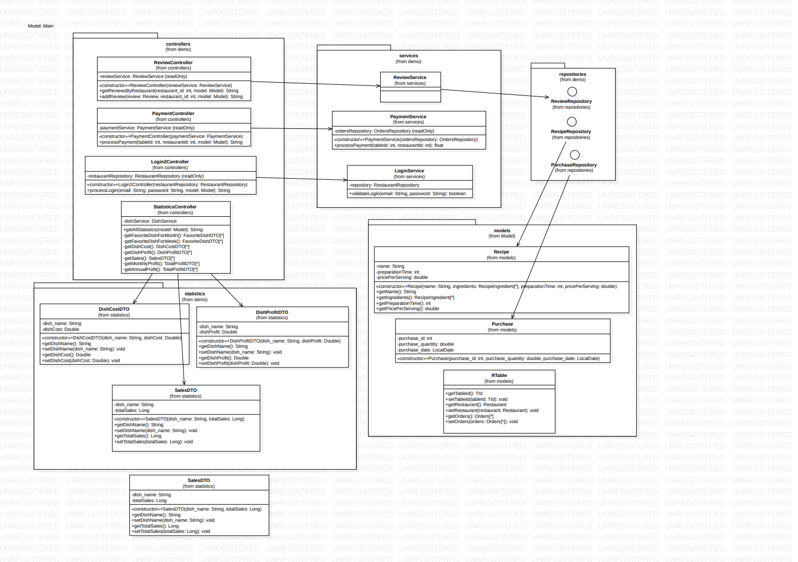

#  EcoDine

H **EcoDine** είναι μία εφαρμογή διαχείρισης εστιατορίων που διευκολύνει τόσο την εμπειρία του πελάτη, όσο και αυτή του εστιάτορα. Η εφαρμογή επιτρέπει στους πελάτες να δουν το μενού, να παραγγείλουν φιλτράροντας προαιρετικά τις επιλογές τους ώστε να ικανοποιήσουν τις αρεσκείες τους (π.χ. Κατηγορίες πιάτων, Αλλεργιογόνα), να πληρώσουν και να αφήσουν κριτικές για τα εστιατόρια. Από την άλλη, στους ιδιοκτήτες εστιατορίων παρέχει ειδοποιήσεις μέσω email για υλικά που λήγουν σύντομα, στατιστικά δεδομένα και προτάσεις για το "πιάτο της ημέρας" με βάση υλικά που πλησιάζουν στην ημερομηνία λήξης, μειώνοντας τη σπατάλη τροφίμων και αυξάνοντας το κέρδος της επιχείρησης.  Παρακάτω περιγράφονται οι οδηγίες για μεταγλώττιση, εκτέλεση, χρήση, η δομή του αποθετηρίου και τα τεχνικά χαρακτηριστικά του έργου.

---

## Οδηγίες Μεταγλώττισης
Για να μεταγλωττίσετε το πρόγραμμα, ακολουθήστε τα παρακάτω βήματα:

1. Βεβαιωθείτε ότι έχετε εγκαταστήσει το **Maven**.
2. Μεταβείτε στον φάκελο του έργου:
   ```bash
   cd Binary-7
   ```
3. Χρησιμοποιήστε την εντολή:
   ```bash
   mvn clean install
   ```
Αυτό θα δημιουργήσει το εκτελέσιμο αρχείο στο φάκελο `target/`.

---

## Οδηγίες Εκτέλεσης

Μετά τη μεταγλώττιση, μπορείτε να εκτελέσετε το πρόγραμμα ως εξής:

1. Εντοπίστε το εκτελέσιμο αρχείο (π.χ. `Binary7.jar`).
2. Εκτελέστε την παρακάτω εντολή:
   ```bash
   java -jar target/Binary7.jar
   ```
3. Το πρόγραμμα θα ξεκινήσει και θα εμφανίσει τις αντίστοιχες επιλογές.

---

## Οδηγίες Χρήσης

Εάν ο χρήστης είναι πελάτης ενός εστιατορίου:

- Μπορεί να δει το menu του εστιατορίου, πατώντας το κουμπί menu/order στο side bar.

- Μπορεί να φιλτράρει το menu, συμπληρώνοντας το ερωτηματολόγιο που φαίνεται στα
αριστερά της οθόνης.

- Μπορεί να παραγγείλει, πατώντας το κουμπί order here, που βρίσκεται κάτω από το
menu. Συμπληρώνοντας τον κωδικό του τραπεζιού και του εστιατορίου, εμφανίζεται στην
οθόνη το menu και μία φόρμα για να προσθέσει ένα πιάτο στην παραγγελία. Στο σημείο
αυτό συμπληρώνει τον κωδικό του πιάτου και την ποσότητα που επιθυμεί να
παραγγείλει.

- Μπορεί να πληρώσει, πατώντας το κουμπί payment στο side bar και συμπληρώνοντας
τον κωδικό του τραπεζιού και του εστιατορίου.

- Τέλος, μπορεί να αφήσει κάποια κριτική, πατώντας το κουμπί review στο side bar και
συμπληρώνοντας τη φόρμα για το εστιατόριο που επιθυμεί, ενώ μπορεί να δει
κριτικές άλλων χρηστών.

Εάν ο χρήστης είναι ιδιοκτήτης ενός εστιατορίου:

- Θα λαμβάνει ειδοποίηση μέσω Email σχετικά με τα υλικά που λήγουν άμεσα και συγκεκριμένα σε διάστημα 7 ημερών. Υπάρχει μια κλάση scheduler που προγραμματίζει ποτέ θα σταλεί το αυτοματοποιημενο Email. Για να τρέξει όλη η λειτουργία του Email δεν χρειάζεται κάποιο curl γιατί το Εmail είναι αυτοματοποιημενο. Απλά πρέπει να αλλαχθεί η ώρα στον scheduler για να λάβει το Email όποιος χρειαστεί να το τρέξει. Ο τωρινός προγραμματισμός του είναι να στέλνεται στις 7:03.

- Υπάρχουν 8 ειδών στατιστικά δεδομένα που εξάγει η ίδια η εφαρμογή : αγαπημένο πιάτο εβδομαδιαίως και μηνιαίως, κόστος ανά πιάτο, κέρδος ανά πιάτο, πωλήσεις ανά πιάτο, μέσος χρόνος ανανέωσης αποθέματος, καθώς και συνολικό κέρδος μηνιαίως και ετησίως. Τα στατιστικά εμφανίζονται στην σελίδα του εστιατορα.

- Δημιουργείται το βέλτιστο πιάτο ημέρας. Η εφαρμογή λαμβάνει από την βάση δεδομένων τα υλικά που λήγουν σύντομα δηλαδη σε διάστημα 7 ημερών. Κάνει αίτημα στο Spoonacular API και από εκεί παίρνει τις συνταγές που περιέχουν αυτά τα συστατικά. Μετά γίνεται βέλτιστοποίηση με τον αλγόριθμο Knapsack και τον αλγόριθμο Greedy ώστε να επιλεχθεί η πιο κατάλληλη συνταγή. Αυτή η συνταγή εμφανίζεται τελικά στην σελίδα του εστιάτορα ως πρόταση για πιάτο ημέρας ώστε να μειωθεί το Food waste και να αξιοποιηθούν πλήρως τα υλικά πριν λήξουν. Ο εστιάτορας εισάγει το budget στην σελίδα του αν επιθυμεί και αν υπάρχουν υλικά που λήγουν, του εμφανίζεται η καλύτερη συνταγή που θα μπορεί να δημιουργήσει ώστε να αποφύγει την σπατάλη υλικών. 

### Παράδειγμα Εκτέλεσης

1. Εκκίνηση προγράμματος:
   ```bash
   java -jar target/Binary7.jar
   ```
2. Εισάγετε [εξήγηση εισαγωγής δεδομένων].
3. Το πρόγραμμα εμφανίζει [εξήγηση εξόδου αποτελεσμάτων].

---

## Δομή Αποθετηρίου

```

Binary-7/
├───.vscode
├───data
│   └───testdb
├───demo
│   ├───.mvn
│   │   └───wrapper
│   ├───data
│   ├───src
│   │   ├───main
│   │   │   ├───java
│   │   │   │   └───com
│   │   │   │       └───example
│   │   │   │           └───demo
│   │   │   │               ├───controllers
│   │   │   │               ├───models
│   │   │   │               ├───repositories
│   │   │   │               ├───services
│   │   │   │               └───statistics
│   │   │   │                   └───dto
│   │   │   └───resources
│   │   │       ├───static
│   │   │       │   ├───css
│   │   │       │   └───images
│   │   │       └───templates
│   │   └───test
│   │       └───java
│   │           └───com
│   │               └───example
│   │                   └───demo
│   │                       ├───controllers
│   │                       ├───models
│   │                       ├───services
│   │                       └───statistics
│   │                           └───dto
│   └───target
│       ├───classes
│       │   ├───com
│       │   │   └───example
│       │   │       └───demo
│       │   │           ├───controllers
│       │   │           ├───models
│       │   │           ├───repositories
│       │   │           ├───services
│       │   │           └───statistics
│       │   │               └───dto
│       │   ├───META-INF
│       │   ├───static
│       │   │   ├───css
│       │   │   └───images
│       │   └───templates
│       ├───generated-sources
│       │   └───annotations
│       ├───generated-test-sources
│       │   └───test-annotations
│       ├───maven-status
│       │   └───maven-compiler-plugin
│       │       ├───compile
│       │       │   └───default-compile
│       │       └───testCompile
│       │           └───default-testCompile
│       └───test-classes
│           └───com
│               └───example
│                   └───demo
│                       ├───controllers
│                       ├───models
│                       ├───services
│                       └───statistics
│                           └───dto
└───restaurantapp
    └───target
        ├───classes
        │   └───com
        │       └───binary7code
        │           └───restaurantapp
        └───test-classes
            └───com
                └───binary7code
                    └───restaurantapp

```
---

## UML Σχεδιασμός

Παρακάτω παρουσιάζεται το διάγραμμα UML της εφαρμογής:


---

## Επισκόπηση Δομών Δεδομένων και Αλγορίθμων

### Δομές Δεδομένων
- **Πίνακες (Arrays):** Χρησιμοποιούνται για την αποθήκευση δεδομένων εισόδου και ενδιάμεσων αποτελεσμάτων.
- **Λίστες (Lists):** Για δυναμική αποθήκευση δεδομένων όταν το μέγεθος δεν είναι προκαθορισμένο.
- **Χάρτες (HashMaps):** Για γρήγορη αναζήτηση και αποθήκευση ζευγών κλειδιών-τιμών.

### Αλγόριθμοι
- **Αναζήτηση Δυαδικής Αναπαράστασης:** Χρησιμοποιείται για τη μετατροπή αριθμών σε δυαδική μορφή και το αντίστροφο.
- **Βελτιστοποιημένοι Αλγόριθμοι Αναζήτησης και Ταξινόμησης:** Για το φιλτράρισμα του μενού με βάση τις προτιμήσεις του πελάτη και την προώθηση των πιο κερδοφόρων πιάτων για την εστιάτορα.
- **Διαχείριση Εξαιρέσεων:** Για την αποφυγή σφαλμάτων κατά την εισαγωγή και επεξεργασία δεδομένων.

---

## License

This project is licensed under the Apache License 2.0 - see the [LICENSE](LICENSE) file for details.
